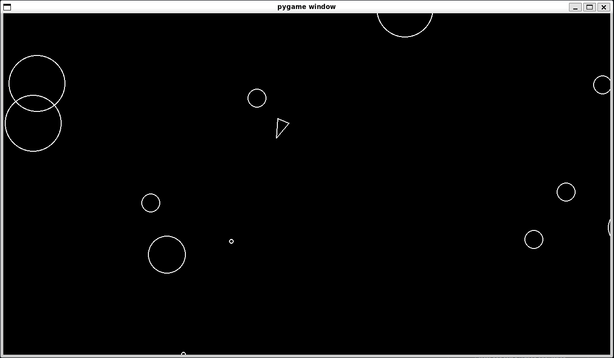

# Asteroids.py (Pygame)

A basic recreation of the classic 1979 Atari game Asteroids using Pygame, created as part of the Boot.dev track.

## Quick Start

1. Ensure Python and Pygame are installed
2. Run: `python main.py`

## Controls

- Arrow keys: Move
- Spacebar: Shoot

## Future Ideas

- Add scoring system
- Multiple lives and respawning
- Explosion effects
- Player acceleration
- Screen wrapping
- Background image
- Different weapon types
- Lumpy asteroids
- Triangular ship hitbox
- Shield power-up
- Speed power-up
- Droppable bombs